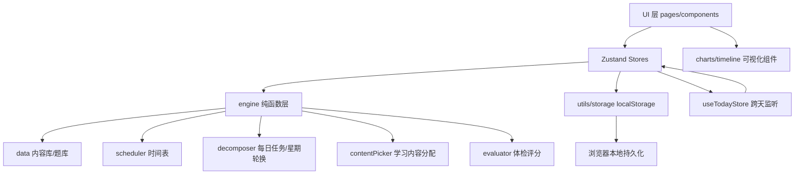

## 产品概述

一款面向 30 岁前端开发者（即将结婚育子）的个人成长管理 Web 应用。通过"自我体检发现不足 → 设定目标 → 自动/手动生成学习与健身任务 → 24 小时时间表规划 → 每日打卡与数据统计"的闭环，从身体、精神上持续提升自己。纯本地运行，手机和电脑浏览器均可访问，无后端、无需登录。

## 核心功能

- **引导式初始化**：首次使用填写姓名、作息时间（起床/睡觉/工作/通勤）、选择成长目标、完成 8 维度初始自评，一键生成个人档案与初始体检
- **自我提升清单（成长体检）**：内置身体、财务、职业技能、人际关系、心态情绪、家庭责任、精神成长、生活管理 8 个维度自评题库；打分后生成雷达图、维度评分与针对性改进建议，支持定期复测对比
- **24 小时时间表规划**：根据作息配置自动生成一天时间块（睡眠/通勤/工作/用餐/学习/健身/家庭/自由），将学习、健身任务自动插入黄金时段；支持手动调整与按天查看编辑
- **每日任务与 0 点自动刷新**：每日任务按日期确定性生成并随星期轮换（如周一练上肢/周二读书/周三理财课）；跨天 0 点自动切换到新一天的"今日"任务与时间线，无需手动刷新；手动任务归属自己添加的日期
- **文字/视频学习内容**：每日自动分配一条与当前目标匹配的"今日学习内容"（带游标轮换避免近期重复）；文字内容 App 内直接阅读，视频内容内嵌播放或一键跳转外链；学习库中每条内容带文字/视频形态徽标，支持用户自定义添加
- **任务打卡与统计**：每日任务一键打卡；记录连续打卡天数、周/月完成率，以日历热力图、趋势折线图、成长曲线可视化呈现
- **学习内容推荐**：内置经典书单、精选课程、分阶段技能成长路径与文字/视频内容库；均可一键"加入今日计划"或关联为目标
- **目标管理**：目标模板库（读 24 本书/每周健身 3 次/学习某项技能等）自动拆解为每日任务；支持手动创建自定义任务；目标可暂停、完成、删除
- **数据管理**：支持本地数据导出 JSON 备份、导入恢复、一键重置

## 视觉与体验

- 深色高级感主题 + 温暖渐变强调色，玻璃拟态卡片与柔和光晕，微交互动效（打卡充能动画、时间块磁吸拖拽）
- 移动端底部导航 + 桌面端顶部导航，响应式布局自适应

## 技术选型

- **前端框架**：React 18 + TypeScript + Vite 5（用户为前端开发者，维护成本低）
- **样式与组件**：Tailwind CSS 3.4.17 + shadcn/ui（Radix UI 基础，无障碍友好）
- **状态管理**：Zustand + persist 中间件，按领域拆分为多个 store，localStorage 持久化
- **图表**：recharts（雷达图、折线图、日历热力图）
- **路由**：react-router-dom（HashRouter，兼容本地 file/静态部署）
- **无后端**：所有数据存于浏览器 localStorage，个人数据量级完全可接受

## 实现方案

### 总体策略

纯前端 SPA，分层架构：**数据层（types/storage/seed 内容库）→ 引擎层（纯函数：时间表生成、每日任务生成、学习内容分配、体检评分）→ 状态层（Zustand stores）→ UI 层（页面/组件）**。引擎层全部为无副作用的纯函数，输入 profile + goals + date 输出确定性结果，UI 层只依赖 store，不直接触碰存储。

### 0 点自动刷新设计（新增需求核心）

- **自动任务"生成式"不落库**：`generateDayTasks(profile, goals, date)` 按 `date` 确定性推导每日任务（依据 goals.dailyMinutes、frequencyPerWeek 与星期轮换规则），跨天后重新推导即为新一天任务，天然实现"0 点刷新"，无需存储清理
- **全局跨天监听**：`useTodayStore` 维护 `today`（YYYY-MM-DD），挂载 `setInterval` 每分钟校验日期变化 + `visibilitychange`/`focus` 事件补偿（休眠恢复场景），跨天时自动更新 today 并触发相关 store 重新生成今日时间表与任务
- **打卡记录按日期落库**：`checkins: Record<date, CheckIn[]>`，自动任务的打卡 id 由 `任务确定性 id = goalId + 日期 + 轮换序号` 推导，保证同日重复访问 id 稳定；手动任务打卡按创建时 id 记录
- **手动任务归属日期**：手动任务带 `date` 字段，仅在其归属日期显示，跨天不影响

### 文字/视频学习内容设计（新增需求核心）

- **统一模型**：`LearningContent { id, type: 'text'|'video', title, category, summary, durationMin, ... }`；text 类型含 `textBody`（正文直接阅读，分段渲染），video 类型含 `videoUrl`（B站/YouTube 外链）与 `embedUrl`（iframe 内嵌地址，用于 App 内播放）
- **每日内容分配**：`pickTodayContent(goals, date, history)` 按日期确定性选择与目标匹配的内容，用"已分配日期记录 + 轮换游标"避免近期重复；今日学习内容卡片展示在今日看板，文字可展开全文阅读（弹层/独立视图），视频可内嵌播放或跳转
- **学习库扩展**：learnContent.ts 内置文字精华文章、书籍章节摘录与视频课程条目；内容条目展示文字/视频徽标，用户可自定义添加文字/视频内容（存 localStorage 的用户内容）

### 关键决策与权衡

- **localStorage 版本化封装**：统一 storage.ts 入口，带数据版本号与 JSON 容错（解析失败回退默认值），为迁移留钩子
- **时间表引擎确定性纯函数**：`generateDaySchedule(profile, goals, date) → DaySchedule`；手动调整以 overrides 覆盖层存储，自动重新生成时保留用户修改
- **打卡统计按日期索引**：checkins 以 `Record<date, CheckIn[]>` 存储，连续天数倒序遍历日期计算，避免全量扫描；图表派生数据统一 `useMemo` 缓存
- **内容库为静态 seed 数据**：书单/课程/技能路径/维度题库/建议库/文字视频内容作为独立 TS 数据文件，与逻辑解耦
- **懒加载**：除今日看板外其余页面用 `React.lazy` 按需加载，控制首屏体积

### 性能与可靠性

- 时间线按天切片渲染，单次仅渲染当天时间块（约 15-25 块），无渲染压力
- 统计页聚合计算全部 memo 化；跨天监听仅每分钟一次轻量日期比对，无性能负担
- 存储写入 try/catch 容错，防止损坏数据白屏；提供导出/导入/重置兜底

### 系统架构



### 目录结构

```
e:/ZSJ/test/
├── index.html
├── package.json
├── vite.config.ts
├── tsconfig.json
├── tailwind.config.js
├── postcss.config.js
└── src/
    ├── main.tsx                    # [NEW] 入口，挂载 App 与全局样式
    ├── App.tsx                     # [NEW] 路由 + 布局框架（顶栏/底栏）
    ├── index.css                   # [NEW] Tailwind + CSS 变量主题（design tokens）
    ├── types/
    │   └── models.ts               # [NEW] 领域模型：Profile/Goal/Task(含date/source/contentId)/LearningContent(text|video)/TimeBlock/DaySchedule/CheckIn/DimensionScore
    ├── data/
    │   ├── dimensions.ts           # [NEW] 8 维度题库（每题 1-5 分）+ 各分数段建议库
    │   ├── learnContent.ts         # [NEW] 文字/视频学习内容库（含正文/视频链接/embedUrl）
    │   ├── books.ts                # [NEW] 经典书单（书名/作者/分类/预估时长/章节指引/推荐理由）
    │   ├── courses.ts              # [NEW] 精选课程清单（平台/时长/适用人群）
    │   ├── skillPaths.ts           # [NEW] 技能成长路径（入门→进阶→精通，每阶段含任务模板）
    │   └── goalTemplates.ts        # [NEW] 目标模板库（模板→每日任务拆解规则）
    ├── engine/
    │   ├── scheduler.ts            # [NEW] 24小时时间表生成：作息固定块 + 黄金时段任务插入 + 冲突处理
    │   ├── decomposer.ts           # [NEW] 每日任务生成：目标→每日任务，按星期轮换确定性推导
    │   ├── contentPicker.ts        # [NEW] 今日学习内容分配：目标匹配 + 日期游标轮换避免重复
    │   └── evaluator.ts            # [NEW] 体检评分：维度均分→百分比→匹配建议库→改进清单
    ├── store/
    │   ├── useTodayStore.ts        # [NEW] 今日日期源 + 跨天监听（0 点自动刷新，interval+visibilitychange）
    │   ├── useProfileStore.ts      # [NEW] 用户资料与作息设置（persist）
    │   ├── useGoalStore.ts         # [NEW] 目标管理（增删改/暂停/完成，persist）
    │   ├── useTaskStore.ts         # [NEW] 任务管理（自动任务生成式 + 手动任务按日期，persist）
    │   ├── useScheduleStore.ts     # [NEW] 每日时间表（生成 + 手动调整覆盖层，persist）
    │   ├── useCheckinStore.ts      # [NEW] 打卡记录（按日期索引，persist）
    │   ├── useContentStore.ts      # [NEW] 今日学习内容分配记录 + 用户自定义内容（persist）
    │   └── useProgressStore.ts     # [NEW] 派生统计：连续天数/完成率/趋势序列（读其余 store 计算）
    ├── utils/
    │   ├── storage.ts              # [NEW] localStorage 封装：版本化、JSON 容错、导出/导入/重置
    │   ├── date.ts                 # [NEW] 日期格式化、加减、周起始、连续天数、HH:mm 时间运算
    │   └── id.ts                   # [NEW] 唯一 ID 生成（时间戳+随机）
    ├── components/
    │   ├── layout/                 # [NEW] TopBar（桌面端）、BottomNav（移动端）
    │   ├── ui/                     # [NEW] shadcn/ui 基础组件（button/card/dialog/switch/tabs/slider/...）
    │   ├── timeline/               # [NEW] DayTimeline 时间轴（时间块渲染、拖拽调整、点击编辑）
    │   ├── charts/                 # [NEW] RadarChart/LineChart/Heatmap 封装（recharts）
    │   └── common/                 # [NEW] ProgressRing、DimensionCard、TaskItem、GoalCard、ContentCard（文字/视频徽标）等
    └── pages/
        ├── Onboarding.tsx          # [NEW] 首次引导：欢迎+作息设置+目标选择+初始体检自评
        ├── TodayPage.tsx           # [NEW] 今日看板：进度环+时间线+任务打卡+今日学习内容卡片（文字阅读/视频播放）+快捷添加
        ├── GrowthPage.tsx          # [NEW] 成长体检：雷达图+维度卡片+建议清单+复测入口
        ├── LearnPage.tsx           # [NEW] 学习库：书单/课程/技能路径/文字视频内容 Tab + 形态徽标 + 加入计划 + 自定义添加
        ├── StatsPage.tsx           # [NEW] 统计：指标卡+日历热力图+趋势曲线+维度成长对比
        └── GoalsPage.tsx           # [NEW] 目标管理+作息设置+数据导出/导入/重置
```

### 关键代码结构

```ts
// types/models.ts — 核心领域模型（其他模块依赖的基础契约）
type TaskSource = 'auto' | 'manual';
type ContentType = 'text' | 'video';

interface Task {
  id: string;                       // auto: goalId+date+轮换序号 确定性推导；manual: 随机 id
  goalId?: string;
  title: string;
  category: 'study' | 'fitness' | 'finance' | 'family' | 'mind' | 'life';
  source: TaskSource;
  date: string;                     // 归属日期 YYYY-MM-DD，跨天自动切换
  contentId?: string;               // 关联学习内容
  durationMin?: number;
}

interface LearningContent {
  id: string;
  type: ContentType;
  title: string;
  category: 'study' | 'finance' | 'mind' | 'family' | 'life';
  summary: string;
  durationMin: number;
  textBody?: string;                // type=text 时：正文（分段 markdown 风格文本）
  videoUrl?: string;                // type=video 时：外链（B站/YouTube）
  embedUrl?: string;                // type=video 时：iframe 内嵌播放地址
}

// engine 纯函数接口约定（实现不在此列出）
generateDayTasks(profile: Profile, goals: Goal[], date: string): Task[];   // 按星期轮换确定性生成
pickTodayContent(goals: Goal[], date: string, assigned: Record<string, string>): LearningContent | null;
generateDaySchedule(profile: Profile, goals: Goal[], tasks: Task[], date: string): DaySchedule;
evaluateDimensions(answers: Record<DimensionId, number[]>): DimensionScore[];
```

## 设计风格

应用定位为"个人成长教练"，设计兼具激励感与高级感：深色夜空基调营造专注与沉淀氛围，温暖渐变（琥珀金 → 珊瑚橙 → 紫罗兰）象征从平凡到闪耀的成长过程。整体采用 **Dark Mode + Glassmorphism**：磨砂玻璃卡片、柔和霓虹光晕、细腻微交互动效（hover 提亮、打卡成功进度环充能动画、时间块磁吸拖拽）。桌面端顶部导航 + 双栏内容布局，移动端底部 Tab 导航 + 单列流式布局，响应式断点切换。

## 页面规划（共 6 屏）

1. **引导页 Onboarding**：品牌区（Logo + 标语"每天进步一点点"）、作息设置表单（起床/睡觉/工作/通勤滑块）、成长目标多选卡片、8 维度初始自评（滑块打分），分步向导式，底部进度条与下一步按钮
2. **今日看板 Today**：顶部问候与日期 + 今日完成度进度环；"今日学习内容"卡片（文字类型可展开正文阅读、视频类型内嵌播放或外链跳转）；中央 24 小时时间线（当前时刻高亮、点击编辑、拖拽调整）；今日任务打卡列表（学习/健身分类，完成打勾动画）；右上角"+"快捷添加任务
3. **成长体检 Growth**：雷达图总览（8 维度）；维度评分卡片网格（分数环形条 + 一句话点评）；"改进建议清单"按优先级分组展示；底部"重新测评"按钮与历史对比
4. **学习库 Learn**：顶部分类 Tab（书单/课程/技能路径/内容库）；书单为封面色块卡片、课程为列表卡片、技能路径为阶段化时间轴、内容库条目带文字/视频徽标；每张卡片含"加入今日计划"按钮；支持自定义添加文字/视频内容
5. **统计 Stats**：顶部 3 张指标卡（连续打卡天数/本周完成率/累计学习时长）；日历热力图（月度打卡密度）；趋势折线图（周完成率/成长曲线切换）；维度成长对比（最近两次体检雷达叠加）
6. **目标与设置 Goals**：目标卡片列表（状态徽标+进度条+暂停/完成操作）；"新建目标"弹窗（模板选择或自定义，自动拆解预览）；作息设置表单；数据管理区（导出 JSON/导入/重置）

## 设计要点

- 全局统一 16px 大圆角卡片、玻璃拟态（backdrop-blur + 半透明边框）、一致的间距体系
- 渐变仅在强调元素使用（进度环、当前时间块、按钮、活跃 Tab），大面积保持深色克制
- 交互反馈：打卡成功进度环充能动画与短暂高亮；跨天自动刷新时 toast 提示"新的一天已开始"
- 文字内容阅读使用舒适的阅读排版（行高 1.8、最大行宽 68ch）；视频内容内嵌播放器

## Agent Extensions

### Skill

- **ui-ux-pro-max**
- Purpose: 制定 6 个页面（Onboarding/Today/Growth/Learn/Stats/Goals）的布局、交互细节与响应式策略，校验设计规范（间距/圆角/动效/无障碍），重点把关"今日学习内容卡片"（文字阅读/视频播放）与"今日看板"的交互设计
- Expected outcome: 输出并落地各页面分块设计规范，UI 实现符合现代设计最佳实践
- **ckm:design-system**
- Purpose: 建立三层设计 token（primitive → semantic → component），产出 CSS 变量体系（颜色/间距/字体/圆角），支撑全局深色玻璃拟态主题一致性
- Expected outcome: 生成 src/index.css 中的主题变量与组件规格，全站风格统一、可扩展
- **ckm:ui-styling**
- Purpose: 基于 shadcn/ui + Tailwind 实现全部页面组件（卡片、对话框、Tab、表单、时间线、内容阅读视图、视频播放器），保证可访问性与视觉精致度
- Expected outcome: 所有页面与通用组件落地，交互流畅、样式统一