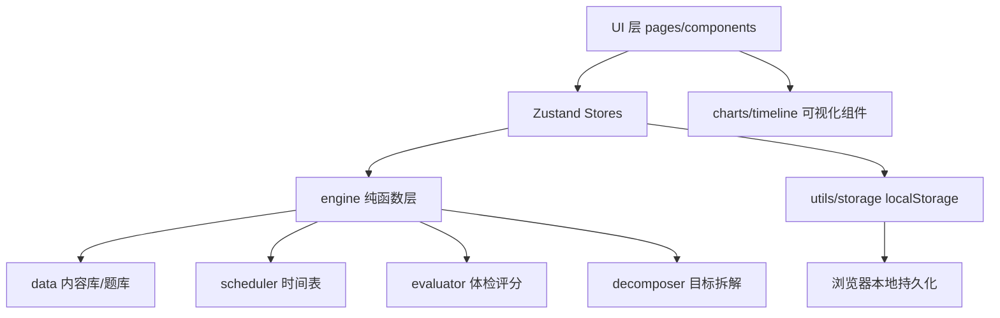

## 产品概述

一款面向 30 岁前端开发者（即将结婚育子）的个人成长管理 Web 应用。帮助用户通过"自我体检发现不足 → 设定目标 → 自动/手动生成学习与健身任务 → 24 小时时间表规划 → 每日打卡与数据统计"的闭环，实现身体与精神的持续提升。纯本地运行，手机和电脑浏览器均可访问，无后端、无需登录。

## 核心功能

- **引导式初始化**：首次使用填写姓名、作息时间（起床/睡觉/工作/通勤）、选择成长目标，快速生成个人档案与初始体检
- **自我提升清单（成长体检）**：内置身体、财务、职业技能、人际关系、心态情绪、家庭责任、精神成长、生活管理 8 个维度自评题库；打分后生成雷达图、维度评分与针对性改进建议，支持定期复测对比
- **24 小时时间表规划**：根据作息配置自动生成一天时间块（睡眠/通勤/工作/用餐/学习/健身/家庭/自由），自动将学习、健身任务插入黄金时段；支持手动调整时间块与任务分配，可按天查看与编辑
- **任务打卡与统计**：每日任务列表一键打卡；记录完成状态、连续打卡天数、周/月完成率，以日历热力图、趋势折线图、成长曲线可视化呈现
- **学习内容推荐**：内置经典书单（含阅读时长预估与章节指引）、精选课程清单、分阶段技能成长路径（如前端进阶、理财入门、表达沟通）；均可一键"加入今日计划"或关联为目标
- **目标管理**：提供目标模板库（读 24 本书/每周健身 3 次/学习某项技能等），App 自动将目标拆解为每日任务；也支持手动创建自定义任务；目标可暂停、完成、删除
- **数据管理**：支持本地数据导出为 JSON 备份、导入恢复、一键重置

## 视觉与体验

- 深色高级感主题 + 温暖渐变强调色，玻璃拟态卡片与柔和光晕，微交互动效
- 移动端底部导航 + 桌面端顶部导航，响应式布局自适应

## 技术选型

- **前端框架**：React 18 + TypeScript + Vite（用户为前端开发者，维护成本低）
- **样式与组件**：Tailwind CSS + shadcn/ui（Radix UI 基础，无障碍友好）
- **状态管理**：Zustand + persist 中间件，按领域拆分为多个 store，localStorage 持久化
- **图表**：recharts（雷达图、折线图、日历热力图）
- **路由**：react-router-dom（HashRouter，兼容本地 file/静态部署）
- **无后端**：所有数据存于浏览器 localStorage，数据量级（个人一年约 7k 条时间块记录）完全可接受

## 实现方案

### 总体策略

纯前端 SPA，采用分层架构：**数据层（types/storage/内容库）→ 引擎层（纯函数：时间表生成、体检评分、目标拆解）→ 状态层（Zustand stores）→ UI 层（页面/组件）**。引擎层全部为无副作用的纯函数，输入 profile + goals + date 输出确定性结果，便于测试与复用；UI 层只依赖 store，不直接触碰存储。

### 关键决策与权衡

- **localStorage 版本化封装**：统一 storage.ts 入口，带数据版本号与 JSON 容错（解析失败时回退默认值），为未来迁移留钩子；相比 IndexedDB 实现更简单，个人数据量足够
- **时间表引擎为确定性纯函数**：`generateDaySchedule(profile, activeGoals, date) → DaySchedule`，任何设置变更后重新生成当日即可；手动调整记录以覆盖层（overrides）形式存储，自动重新生成时保留用户修改
- **打卡统计按日期索引**：checkins 以 `Record<date, CheckIn[]>` 存储，连续天数用倒序遍历日期计算，避免全量扫描；图表派生数据统一用 `useMemo` 缓存
- **内容库为静态 seed 数据**：书单/课程/技能路径/维度题库/建议库作为独立 TS 数据文件，与逻辑解耦，方便扩充
- **懒加载**：除今日看板外，其余页面用 `React.lazy` 按需加载，控制首屏体积

### 性能与可靠性

- 时间线按天切片渲染，单次只渲染当天时间块（约 15-25 块），无渲染压力
- 统计页聚合计算全部 memo 化，仅在数据变更时重算
- 所有存储写入做 try/catch 容错，防止损坏数据导致白屏；提供导出/导入/重置兜底

### 系统架构



### 目录结构

```
e:/ZSJ/test/
├── index.html
├── package.json
├── vite.config.ts
├── tsconfig.json
└── src/
    ├── main.tsx                    # 入口，挂载 App 与全局样式
    ├── App.tsx                     # 路由 + 布局框架（顶栏/底栏/侧边栏）
    ├── index.css                   # Tailwind + CSS 变量主题（design tokens）
    ├── types/
    │   └── models.ts               # [NEW] 领域模型：Profile/Goal/Task/TimeBlock/DaySchedule/CheckIn/DimensionScore
    ├── data/
    │   ├── dimensions.ts           # [NEW] 8 维度题库（每题 1-5 分）+ 各分数段建议库
    │   ├── books.ts                # [NEW] 内置书单（书名/作者/分类/预估阅读时长/章节指引/推荐理由）
    │   ├── courses.ts              # [NEW] 精选课程清单（平台/时长/适用人群）
    │   ├── skillPaths.ts           # [NEW] 技能成长路径（阶段化：入门→进阶→精通，每阶段含任务模板）
    │   └── goalTemplates.ts        # [NEW] 目标模板库（模板→每日任务拆解规则）
    ├── engine/
    │   ├── scheduler.ts            # [NEW] 24小时时间表生成：作息固定块 + 黄金时段任务插入 + 冲突处理
    │   ├── evaluator.ts            # [NEW] 体检评分：维度均分→百分比→匹配建议库→生成改进清单
    │   └── decomposer.ts           # [NEW] 目标拆解：目标→每日任务模板→按周轮换生成每日任务
    ├── store/
    │   ├── useProfileStore.ts      # [NEW] 用户资料与作息设置（persist）
    │   ├── useGoalStore.ts         # [NEW] 目标管理（增删改/暂停/完成，persist）
    │   ├── useTaskStore.ts         # [NEW] 任务管理（自动+手动任务，手动覆盖保留，persist）
    │   ├── useScheduleStore.ts     # [NEW] 每日时间表（生成+手动调整覆盖层，persist）
    │   ├── useCheckinStore.ts      # [NEW] 打卡记录（按日期索引，persist）
    │   └── useProgressStore.ts     # [NEW] 派生统计：连续天数/完成率/趋势序列（读其余 store 计算）
    ├── utils/
    │   ├── storage.ts              # [NEW] localStorage 封装：版本化、JSON 容错、导出/导入/重置
    │   ├── date.ts                 # [NEW] 日期格式化、加减、周起始、连续天数计算工具
    │   └── id.ts                   # [NEW] 唯一 ID 生成（时间戳+随机）
    ├── components/
    │   ├── layout/                 # [NEW] TopBar、BottomNav（移动端）、SideNav（桌面端）
    │   ├── ui/                     # [NEW] shadcn/ui 基础组件（button/card/dialog/switch/tabs/...）
    │   ├── timeline/               # [NEW] DayTimeline 时间轴（时间块渲染、拖拽调整、点击编辑）
    │   ├── charts/                 # [NEW] RadarChart/LineChart/Heatmap 封装（recharts）
    │   └── common/                 # [NEW] ProgressRing 进度环、DimensionCard、TaskItem、GoalCard 等
    └── pages/
        ├── Onboarding.tsx          # [NEW] 首次引导：欢迎+作息设置+目标选择+初始体检自评
        ├── TodayPage.tsx           # [NEW] 今日看板：问候+进度环+时间线+任务打卡+快捷添加
        ├── GrowthPage.tsx          # [NEW] 成长体检：雷达图+维度卡片+建议清单+复测入口
        ├── LearnPage.tsx           # [NEW] 学习库：书单/课程/技能路径 Tab + 加入计划
        ├── StatsPage.tsx           # [NEW] 统计：指标卡+日历热力图+趋势曲线+维度成长对比
        └── GoalsPage.tsx           # [NEW] 目标管理+作息设置+数据导出/导入/重置
```

### 关键代码结构

```ts
// types/models.ts — 核心领域模型（其他模块依赖的基础契约）
type TimeBlockType = 'sleep'|'work'|'commute'|'meal'|'study'|'fitness'|'family'|'free';

interface TimeBlock {
  id: string; type: TimeBlockType; title: string;
  start: string; end: string;          // "HH:mm"
  taskId?: string;                     // 关联任务
  locked?: boolean;                    // 固定块不可删，可改时间
}

interface DaySchedule {
  date: string;                        // YYYY-MM-DD
  blocks: TimeBlock[];
  overrides: Record<string, Partial<TimeBlock>>; // 手动调整覆盖层
}

interface Goal {
  id: string; title: string; category: 'study'|'fitness'|'finance'|'family'|'mind'|'life';
  templateId?: string; dailyMinutes: number; frequencyPerWeek: number;
  status: 'active'|'paused'|'done'; startDate: string; createdAt: string;
}

interface CheckIn {
  taskId: string; completed: boolean; completedAt?: string; durationMin?: number;
}
// store 中 checkins: Record<date, CheckIn[]>
```

```ts
// engine 纯函数接口约定（实现不在此列出）
generateDaySchedule(profile: Profile, goals: Goal[], date: string): DaySchedule;
evaluateDimensions(answers: Record<DimensionId, number[]>): DimensionScore[];
decomposeGoals(goals: Goal[], date: string): Task[];   // 目标→每日任务
```

## 设计风格

应用定位为"个人成长教练"，设计需兼具激励感与高级感：深色夜空基调营造专注与沉淀氛围，温暖渐变（琥珀金→珊瑚橙→紫罗兰）象征从平凡到闪耀的成长过程。整体采用 **Dark Mode + Glassmorphism** 风格：磨砂玻璃卡片、柔和霓虹光晕、细腻的微交互动效（hover 提亮、打卡成功的粒子/进度环动画），让每一次完成都获得即时正向反馈。桌面端为顶部导航 + 双栏内容布局，移动端为底部 Tab 导航 + 单列流式布局，响应式断点切换。

## 页面规划（共 6 屏）

1. **引导页 Onboarding**：品牌区（Logo+标语）、作息设置表单（起床/睡觉/工作/通勤滑块）、成长目标多选卡片、8 维度初始自评（滑块打分），分步向导式，底部进度条
2. **今日看板 Today**：顶部问候与日期 + 今日完成度进度环；中央 24 小时时间线（当前时刻高亮、可点击编辑/拖拽调整）；下方今日任务打卡列表（学习/健身分类，完成打勾动画）；右上角"+"快捷添加任务
3. **成长体检 Growth**：雷达图总览（8 维度）；维度评分卡片网格（分数环形条 + 一句话点评）；"改进建议清单"分组展示（按优先级排序）；底部"重新测评"按钮（历史对比曲线）
4. **学习库 Learn**：顶部分类 Tab（书单/课程/技能路径）；书单为封面色块卡片（书名+作者+预估时长+推荐理由）；课程为列表卡片；技能路径为阶段化时间轴（入门→进阶→精通）；每张卡片含"加入今日计划"按钮
5. **统计 Stats**：顶部 3 张指标卡（连续打卡天数/本周完成率/累计学习时长）；日历热力图（月度打卡密度）；趋势折线图（周完成率/成长曲线切换）；维度成长对比（最近两次体检雷达叠加）
6. **目标与设置 Goals**：目标卡片列表（状态徽标+进度条+暂停/完成操作）；"新建目标"弹窗（模板选择或自定义，自动拆解预览）；作息设置表单；数据管理区（导出 JSON/导入/重置）

## 设计要点

- 所有页面保持一致的卡片语言与圆角体系（16px 大圆角）、统一的玻璃拟态（backdrop-blur + 半透明边框）
- 渐变仅在强调元素使用（进度环、当前时间块、按钮、活跃 Tab），大面积保持深色克制，避免视觉疲劳
- 交互反馈：打卡成功有进度环充能动画与短暂高亮；时间块拖拽有磁吸吸附；夜间使用深色模式护眼

## Agent Extensions

### Skill

- **ui-ux-pro-max**
- Purpose: 制定页面布局、交互细节与响应式策略，校验设计规范（间距/圆角/动效/无障碍），确保 6 个页面的设计质量
- Expected outcome: 输出并落地各页面分块设计规范，UI 实现符合现代设计最佳实践
- **ckm:design-system**
- Purpose: 建立三层设计 token（primitive→semantic→component），产出 CSS 变量体系（颜色/间距/字体/圆角），支撑全局主题一致性
- Expected outcome: 生成 src/index.css 中的主题变量与组件规格，全站风格统一、可扩展
- **ckm:ui-styling**
- Purpose: 基于 shadcn/ui + Tailwind 实现全部页面组件（卡片、对话框、Tab、表单、时间线等），保证可访问性与视觉精致度
- Expected outcome: 所有页面与通用组件落地，交互流畅、样式统一