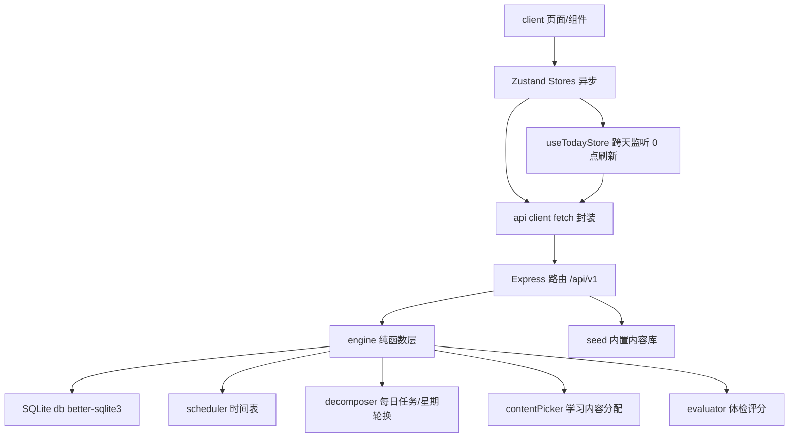

## 产品概述

一款面向 30 岁前端开发者（即将结婚育子）的个人成长管理全栈应用。通过"8 维度成长体检发现不足 → 设定目标 → 每日任务自动/手动生成 → 24 小时时间表规划 → 每日打卡与统计"的闭环，从身体、精神上持续提升自己。所有每日数据（任务、打卡、时间表、体检、内容分配）由后端记录并持久化到 SQLite，手机和电脑浏览器均可访问。

## 核心功能

- **引导式初始化**：首次使用填写姓名、作息时间（起床/睡觉/工作/通勤）、选择成长目标、完成 8 维度初始自评，一键生成个人档案与初始体检
- **自我提升清单（成长体检）**：内置身体、财务、职业技能、人际关系、心态情绪、家庭责任、精神成长、生活管理 8 个维度自评题库；打分后生成雷达图、维度评分与针对性改进建议，支持定期复测对比
- **24 小时时间表规划**：根据作息配置自动生成一天时间块（睡眠/通勤/工作/用餐/学习/健身/家庭/自由），学习、健身任务自动插入黄金时段；支持手动调整与按天查看编辑
- **每日任务与 0 点自动刷新**：每日任务按日期确定性生成并随星期轮换（周一练上肢/周二读书/周三理财课）；跨天 0 点自动切换到新一天的"今日"任务与时间线，无需手动刷新；手动任务归属自己添加的日期
- **文字/视频学习内容**：每日自动分配一条与目标匹配的"今日学习内容"（游标轮换避免近期重复）；文字内容 App 内直接阅读，视频内容内嵌播放或一键跳转外链；学习库每条内容带文字/视频形态徽标，支持用户自定义添加
- **任务打卡与统计**：每日任务一键打卡；记录连续打卡天数、周/月完成率，以日历热力图、趋势折线图、成长曲线可视化呈现
- **学习内容推荐**：内置经典书单、精选课程、分阶段技能成长路径与文字/视频内容库；均可一键"加入今日计划"或关联为目标
- **目标管理**：目标模板库自动拆解为每日任务；支持手动创建自定义任务；目标可暂停、完成、删除
- **数据管理**：后端 SQLite 持久化，支持导出 JSON 备份、导入恢复、一键重置

## 视觉与体验

- 深色高级感主题 + 温暖渐变强调色（琥珀金→珊瑚橙→紫罗兰），玻璃拟态卡片与柔和光晕，微交互动效（打卡充能动画、时间块拖拽磁吸）
- 移动端底部导航 + 桌面端顶部导航，响应式布局自适应

## 技术栈

- **前端**：React 18 + TypeScript + Vite 5 + Tailwind CSS 3.4.17 + shadcn/ui（Radix UI）+ Zustand + recharts + react-router-dom（HashRouter）+ lucide-react
- **后端**：Node.js + Express + better-sqlite3（同步 API、Windows 预编译友好）+ cors，TypeScript 编写、tsx 运行
- **数据库**：SQLite 单文件（data/growth.db），首次启动自动建表并 seed 内置内容库
- **工程化**：根目录 package.json 用 concurrently 同时启动 server(3001) 与 vite(5173)，vite proxy 将 /api 转发至 3001；固定版本：vite 5、typescript 5、tailwindcss 3.4.17、postcss 8.5、autoprefixer ^10.4.20

## 实现方案

### 总体策略

全栈分层架构：**shared 共享类型 → server（数据层 db/seed + 引擎层 engine 纯函数 + API 层 routes）→ client（api client + Zustand store + 页面/组件）**。业务引擎（每日任务生成、时间表生成、学习内容分配、体检评分）全部置于后端纯函数层，输入 profile + goals + date 输出确定性结果；前端只做展示与交互，通过 REST API 读写数据。

### 关键决策与权衡

- **后端落库所有每日数据**：任务、时间表、打卡、体检、内容分配全部写入 SQLite；自动任务由后端按"日期+星期轮换"确定性生成后写入当日 tasks 表，重复请求幂等（同日任务不存在则生成，存在则直接返回），天然满足 0 点刷新
- **0 点跨天刷新**：前端 useTodayStore 维护 today，setInterval 每分钟比对日期 + visibilitychange/focus 事件补偿（休眠恢复场景）；检测到跨天后重新请求当日 tasks/schedule/content/today 接口，并弹出"新的一天已开始"提示
- **打卡幂等**：checkins 以 PRIMARY KEY(date, taskId) 唯一约束，PUT 幂等写入，避免重复打卡脏数据
- **时间表可调**：手动调整以覆盖字段（start/end/title/taskId）更新对应 timeblocks 行；重新生成仅重建未锁定块，保留用户修改
- **内容分配避免重复**：content_assignments 记录每日分配，pickTodayContent 优先选择未分配且匹配目标的内容，滚动回绕
- **统计聚合后端化**：/stats 接口在 SQLite 内聚合（连续天数倒序扫描、周/月完成率、热力图、累计时长、趋势序列），前端用 useMemo 缓存结果
- **单用户无鉴权**：个人本地使用，后端监听 localhost:3001；如需可后续扩展
- **懒加载**：除今日看板外其余页面用 React.lazy 按需加载，控制首屏体积

### 性能与可靠性

- 时间线按天切片渲染（15-25 块/天），SQLite 同步查询毫秒级；/stats 聚合查询加索引（tasks.date、checkins.date）
- better-sqlite3 单连接串行执行，避免并发写锁；所有写操作在事务内完成（生成当日任务、内容分配）
- Express 统一错误处理中间件返回 {error} JSON；前端 api client 统一错误提示，杜绝白屏
- 提供导出 JSON / 导入恢复 / 一键重置接口兜底

### 系统架构



### 目录结构

```
e:/ZSJ/test/
├── package.json                 # [NEW] 根工程：concurrently 并行启动 server+client，统一脚本
├── vite.config.ts               # [NEW] Vite 配置：server 端口5173、proxy /api→http://localhost:3001
├── tsconfig.json / tsconfig.node.json  # [NEW] TS 配置：verbatimModuleSyntax=false、noUnusedLocals=false
├── tailwind.config.js / postcss.config.js  # [NEW] Tailwind 3.4.17 + autoprefixer 配置
├── index.html                   # [NEW] SPA 入口 HTML
├── shared/
│   └── types.ts                 # [NEW] 共享领域类型：Profile/Goal/Task/LearningContent/TimeBlock/DaySchedule/CheckIn/DimensionScore/Stats（前后端共同引用）
└── server/
    ├── package.json             # [NEW] 后端依赖：express/cors/better-sqlite3/tsx
    └── src/
        ├── index.ts             # [NEW] Express 入口：cors/json 中间件、挂载路由、统一错误处理、启动监听 3001
        ├── db.ts                # [NEW] better-sqlite3 连接、建表语句（profile/goals/tasks/timeblocks/checkins/assessments/content_assignments/custom_contents + 内容库 seed 表）、索引
        ├── seed.ts              # [NEW] 内置内容库 seed 数据：8维度题库/建议库/书单/课程/技能路径/文字视频内容/目标模板
        ├── engine/
        │   ├── decomposer.ts    # [NEW] 每日任务生成：目标→每日任务，按星期轮换确定性推导，幂等写入当日 tasks
        │   ├── scheduler.ts     # [NEW] 24小时时间表生成：作息固定块 + 黄金时段任务插入 + 冲突处理，保留手动覆盖
        │   ├── contentPicker.ts # [NEW] 今日学习内容分配：目标匹配 + 已分配记录避免重复 + 游标轮换
        │   └── evaluator.ts     # [NEW] 体检评分：维度均分→百分比→匹配建议库→改进清单（存 assessments）
        └── routes/
            ├── profile.ts       # [NEW] GET/PUT /profile
            ├── goals.ts         # [NEW] GET/POST/PATCH/DELETE /goals
            ├── tasks.ts         # [NEW] GET /tasks?date=、POST 手动任务、PATCH/DELETE /tasks/:id
            ├── schedule.ts      # [NEW] GET /schedule?date=（惰性生成）、PATCH /schedule/:date/blocks/:id
            ├── checkins.ts      # [NEW] GET /checkins?date=、PUT /checkins/:date/:taskId（幂等）
            ├── assessments.ts   # [NEW] POST /assessments、GET /assessments（历史+最近两次对比）
            ├── content.ts       # [NEW] GET /content/today?date=、GET /content/library、POST/PATCH /content（自定义）
            ├── stats.ts         # [NEW] GET /stats：连续天数/完成率/累计时长/热力图/趋势
            └── seed.ts          # [NEW] GET /seed/library：书单/课程/技能路径/题库/目标模板
└── client/
    └── src/
        ├── main.tsx             # [NEW] React 入口，挂载 App 与全局样式
        ├── App.tsx              # [NEW] HashRouter + 布局（顶栏/底栏）+ 懒加载路由 + 首次引导判断
        ├── index.css            # [NEW] Tailwind + CSS 变量主题（深色玻璃拟态 design tokens）
        ├── api/
        │   └── client.ts        # [NEW] fetch 封装：baseURL /api/v1、JSON 序列化、统一错误抛出
        ├── store/
        │   ├── useTodayStore.ts     # [NEW] 今日日期 + 跨天监听（interval+visibilitychange/focus），跨天触发数据重拉
        │   ├── useProfileStore.ts   # [NEW] 用户资料与作息（GET/PUT /profile）
        │   ├── useGoalStore.ts      # [NEW] 目标管理（CRUD /goals）
        │   ├── useTaskStore.ts      # [NEW] 当日任务（GET /tasks?date=、手动增删改）
        │   ├── useScheduleStore.ts  # [NEW] 当日时间表（GET /schedule、块覆盖 PATCH）
        │   ├── useCheckinStore.ts   # [NEW] 打卡（GET /checkins、PUT 打卡）
        │   ├── useContentStore.ts   # [NEW] 今日内容（GET /content/today）与内容库（library/自定义）
        │   └── useProgressStore.ts  # [NEW] 统计（GET /stats）缓存
        ├── utils/
        │   ├── date.ts          # [NEW] 日期格式化/加减/周起始/HH:mm 时间运算/星期文案
        │   └── id.ts            # [NEW] 唯一 ID 生成（时间戳+随机）
        ├── components/
        │   ├── layout/          # [NEW] TopBar（桌面端顶部导航）、BottomNav（移动端底部 Tab）
        │   ├── ui/              # [NEW] shadcn/ui 基础组件（button/card/dialog/switch/tabs/slider/input/...）
        │   ├── timeline/        # [NEW] DayTimeline 时间轴（时间块渲染、拖拽调整、点击编辑）
        │   ├── charts/          # [NEW] RadarChart/LineChart/Heatmap 封装（recharts）
        │   └── common/          # [NEW] ProgressRing、DimensionCard、TaskItem、GoalCard、ContentCard（文字/视频徽标）、ContentViewer（文字阅读/视频播放）
        └── pages/
            ├── Onboarding.tsx   # [NEW] 首次引导：欢迎+作息设置+目标选择+初始体检自评，分步向导
            ├── TodayPage.tsx    # [NEW] 今日看板：问候+进度环+时间线+任务打卡+今日学习内容卡片+快捷添加
            ├── GrowthPage.tsx   # [NEW] 成长体检：雷达图+维度卡片+建议清单+复测入口+历史对比
            ├── LearnPage.tsx    # [NEW] 学习库：书单/课程/技能路径/内容库 Tab+形态徽标+加入计划+自定义添加
            ├── StatsPage.tsx    # [NEW] 统计：指标卡+日历热力图+趋势曲线+维度成长对比
            └── GoalsPage.tsx    # [NEW] 目标管理+作息设置+数据导出/导入/重置
```

### 关键代码结构

```ts
// shared/types.ts — 核心领域契约（前后端共享）
type TaskSource = 'auto' | 'manual';
type ContentType = 'text' | 'video';

interface Task {
  id: string; goalId?: string; title: string;
  category: 'study' | 'fitness' | 'finance' | 'family' | 'mind' | 'life';
  source: TaskSource; date: string;       // YYYY-MM-DD 归属日期
  contentId?: string; durationMin?: number; sortOrder: number;
}

interface LearningContent {
  id: string; type: ContentType; title: string;
  category: 'study' | 'finance' | 'mind' | 'family' | 'life';
  summary: string; durationMin: number;
  textBody?: string;   // type=text 时正文
  videoUrl?: string;   // type=video 时外链
  embedUrl?: string;   // type=video 时 iframe 内嵌地址
}

interface CheckIn {
  date: string; taskId: string;
  completed: boolean; completedAt?: string; durationMin?: number;
}

interface Assessment {
  id: number; date: string;
  scores: Record<string, number>;   // 维度百分比
  answers: Record<string, number[]>; // 每题原始分
}
```

```ts
// server engine 纯函数接口约定（实现不在此列出）
generateDayTasks(profile: Profile, goals: Goal[], date: string): Task[];         // 幂等：不存在则写入当日
generateDaySchedule(profile: Profile, tasks: Task[], date: string): TimeBlock[]; // 惰性生成，保留手动覆盖
pickTodayContent(goals: Goal[], date: string, assigned: Set<string>): LearningContent | null;
evaluateDimensions(answers: Record<DimensionId, number[]>): DimensionScore[];    // 存 assessments
```

## 实施要点

- 后端所有路由挂载统一前缀 /api/v1；每日任务生成、时间表生成、内容分配均在对应 GET 路由内惰性触发（幂等），保证 0 点后首次请求即为新一天数据
- 前端 useTodayStore 是跨天刷新的唯一枢纽：today 变化后由各业务 store 订阅并重新拉取当日数据；页面不直接依赖 Date.now()
- 打卡按钮即时乐观更新 + 失败回滚；统计页 /stats 结果 useMemo 缓存，仅数据版本号变化时重拉
- 深色玻璃拟态主题统一走 CSS 变量（design tokens），组件不写死色值；渐变仅用于强调元素
- 部署运行：npm install（根目录安装 concurrently，server 与 client 分别 install 或根目录统一安装），npm run dev 一键启动

## 设计风格

应用定位为"个人成长教练"，设计兼具激励感与高级感。深色夜空基调（#0B0F1A）营造专注与沉淀氛围，温暖渐变（琥珀金 → 珊瑚橙 → 紫罗兰）象征从平凡到闪耀的成长过程。整体采用 Dark Mode + Glassmorphism：磨砂玻璃卡片（backdrop-blur + 半透明边框）、柔和霓虹光晕、细腻微交互动效（hover 提亮、打卡成功进度环充能动画、时间块拖拽磁吸）。桌面端顶部导航 + 双栏内容布局，移动端底部 Tab 导航 + 单列流式布局，响应式断点切换（md 768px）。

## 页面规划（6 屏）

1. **引导页 Onboarding**：品牌区（Logo + 标语"每天进步一点点"）、作息设置表单（起床/睡觉/工作/通勤滑块）、成长目标多选卡片、8 维度初始自评（滑块打分），分步向导式，底部进度条与下一步按钮
2. **今日看板 Today**：顶部问候与日期 + 今日完成度进度环；"今日学习内容"卡片（文字可展开正文阅读、视频内嵌播放或外链跳转）；中央 24 小时时间线（当前时刻高亮、点击编辑、拖拽调整）；今日任务打卡列表（学习/健身分类，完成打勾动画）；右上角"+"快捷添加任务
3. **成长体检 Growth**：雷达图总览（8 维度）；维度评分卡片网格（分数环形条 + 一句话点评）；"改进建议清单"按优先级分组展示；底部"重新测评"按钮与历史对比
4. **学习库 Learn**：顶部分类 Tab（书单/课程/技能路径/内容库）；书单为封面色块卡片、课程为列表卡片、技能路径为阶段化时间轴、内容库条目带文字/视频徽标；每张卡片含"加入今日计划"按钮；支持自定义添加文字/视频内容
5. **统计 Stats**：顶部 3 张指标卡（连续打卡天数/本周完成率/累计学习时长）；日历热力图（月度打卡密度）；趋势折线图（周完成率/成长曲线切换）；维度成长对比（最近两次体检雷达叠加）
6. **目标与设置 Goals**：目标卡片列表（状态徽标+进度条+暂停/完成操作）；"新建目标"弹窗（模板选择或自定义，自动拆解预览）；作息设置表单；数据管理区（导出 JSON/导入/重置）

## 设计要点

- 全局统一 16px 大圆角卡片、玻璃拟态、一致间距体系；渐变仅在强调元素使用，大面积深色克制
- 文字内容阅读使用舒适排版（行高 1.8、最大行宽 68ch）；视频内容内嵌 iframe 播放器
- 跨天自动刷新 toast 提示"新的一天已开始"；交互反馈即时且可感知

## Agent Extensions

### Skill

- **ui-ux-pro-max**
- Purpose: 制定 6 个页面的布局、交互细节与响应式策略，校验设计规范（间距/圆角/动效/无障碍），重点把关"今日学习内容卡片"（文字阅读/视频播放）与"今日看板"的交互设计
- Expected outcome: 输出并落地各页面分块设计规范，UI 实现符合现代设计最佳实践
- **ckm:design-system**
- Purpose: 建立三层设计 token（primitive → semantic → component），产出 CSS 变量体系（颜色/间距/字体/圆角），支撑全局深色玻璃拟态主题一致性
- Expected outcome: 生成 client/src/index.css 中的主题变量与组件规格，全站风格统一、可扩展
- **ckm:ui-styling**
- Purpose: 基于 shadcn/ui + Tailwind 实现全部页面组件（卡片、对话框、Tab、表单、时间线、内容阅读视图、视频播放器），保证可访问性与视觉精致度
- Expected outcome: 所有页面与通用组件落地，交互流畅、样式统一